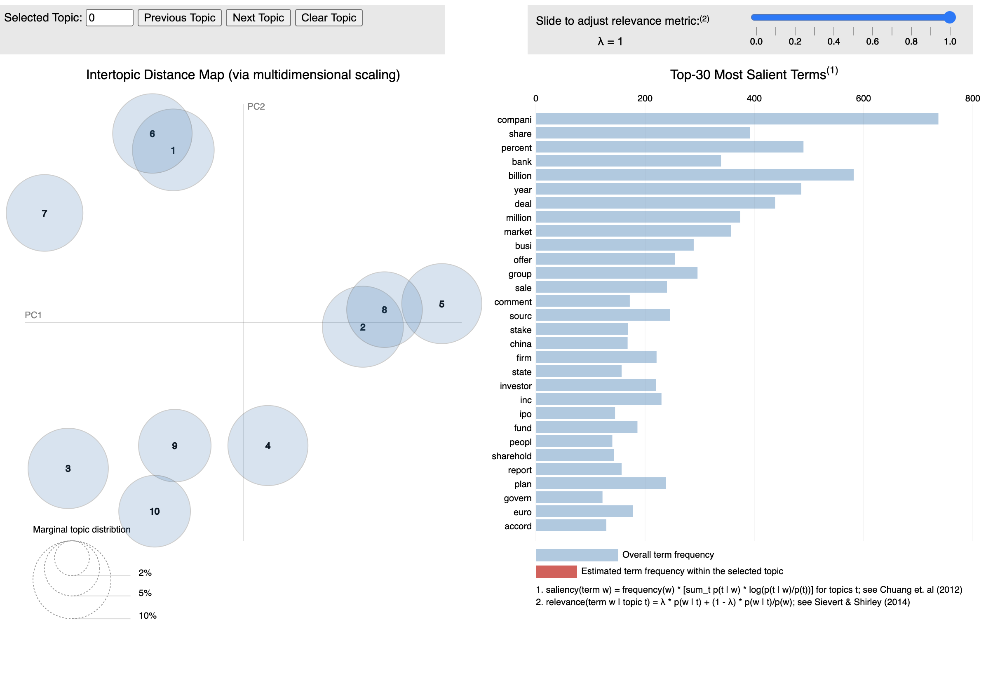

# Topic modeling 

## Methods Used:           
Latent Dirichlet Allocation (LDA)              
Gibbs Sampling   
Jensen-Shannon Divergence & Principal Components                              

## Code:
reuters_topic_model.R
## Requirements: 
R packages:slam, NLP, tm, SnowballC, LDAvis, servr, topicmodels
## Data:
Corpus created using Thomson Reuters "Deals Today" newsletters.
## Visualization:

LDAvis Creates a JSON object to feed the javascript visualization.

The aim of this visualization is to aid interpretation of topics. 
Topic interpretation tends to be difficult since each topic is defined by a probability distribution with support over many of words. 
With this interactive visualization, one can focus on the most "relevant" words for any topic by hovering/clicking over the appropriate circle. 

The blue bars indicate the overall frequency of terms in the corpus and the red bars indicate frequency of the terms in the selected topic. The topic specific word rankings are determined by a measure known as relevance. Relevance is a compromise between the probability of a word given the topic (the width of the red bars) and the probability within topic divided by the overall frequency of the word (the ratio of red to blue). Note the "Value of lambda" slider which controls this compromise. A value of 1 for lambda will rank words solely on the width of the red bars (which tends to over-rank common words). A value of 0 for lambda will rank words solely on the ratio of red to gray (which tends to over-rank rare words). A recent study has shown evidence for an optimal value of lambda around 0.6 which is the default value.

The "topic landscape" on the left-hand side provides a sense of topic similarity by approximating distances between topics. To produce the point locations, pairwise distances between topic specific word distributions are computed according to the Distance Calculation method used (Jensen-Shannon). Those distances are next scaled down to two dimensions using a "Multidimensional Scaling Method" (classical PCA). 

By default, the circle sizes are proportional to the prevalence of each topic in the collection of text.
Hovering over labels on the bar chart allows us to explore different contexts for the same word. Upon hovering over a word, circles in the topic landscape will change according to the distribution over topics for that given word.

Distance Calculation method used: Dimension reduction via Jensen-Shannon Divergence & Principal Components (jsPCA ).
jsPCA method approximates the distance between topics. 

PC1: Principle Component 1: Eigen Vector associated with the largest Eigen value of covariance matrix

PC2: Principle Component 2 : Eigen vector in direction orthogonal to first (Has second largest Eigen value)

Principal Component is obtained from the Covariance Matrix.

Characteristic Equation:
(V − λI)a = 0 

(where V = Covariance matrix, λ=eigen values, a=projection weights)

Here is a good description for LDAvis visualizations: https://www.youtube.com/watch?v=tGxW2BzC_DU

            
                                                                      
                        